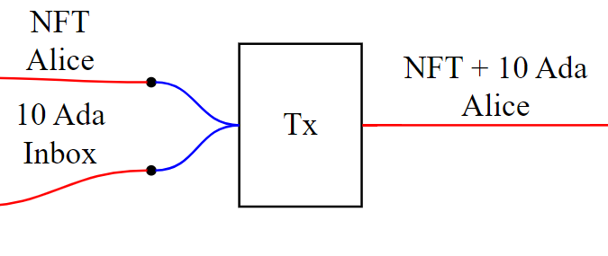

# plutus-inbox-nfts
A script that allows to consume locked funds only in a transaction that includes a certain NFT (which is the parameter of the script).

The script is written in [Plutarch](https://github.com/Plutonomicon/plutarch).

## How to use this
The script has two parameters: the NFT's `CurrencySymbol` and `TokenName`.
The funds are only unlocked if they (and only they) are transferred entirely to the UTXO containing the NFT.

